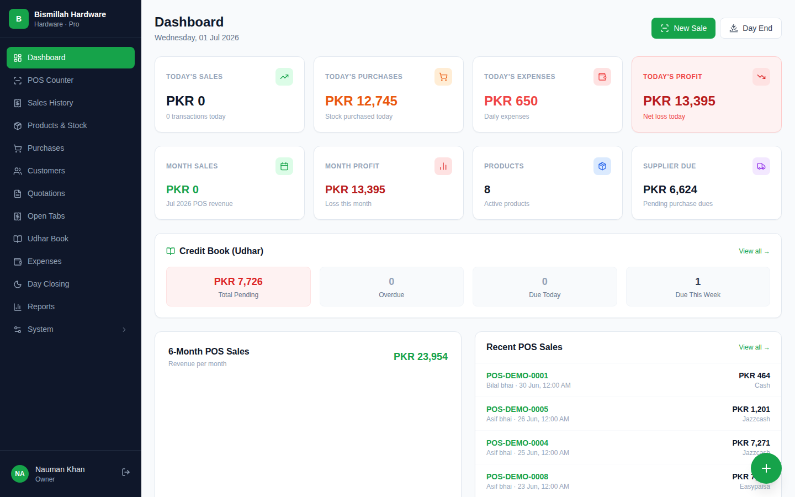
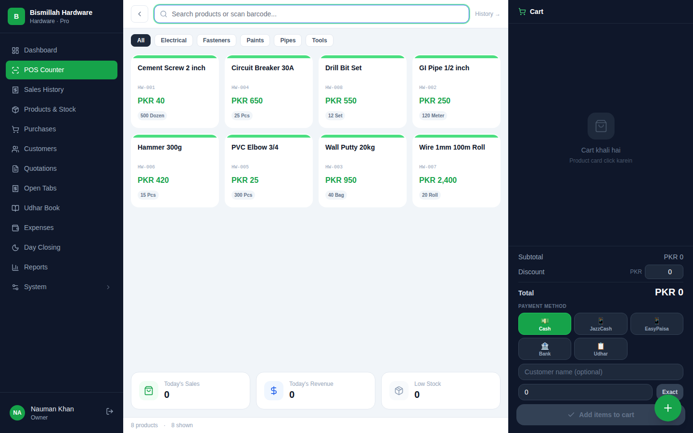
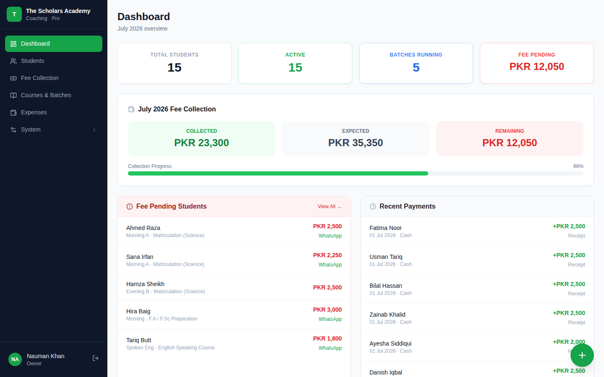
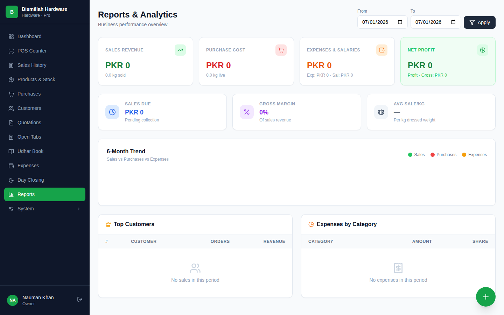

# ShopSaas

**A multi-tenant SaaS billing platform for Pakistani small businesses** — POS, credit book (udhar), day closing, and shop management for 7 shop types, with each tenant on its own subdomain and isolated database.


## Screenshots

<table>
  <tr>
    <td></td>
    <td></td>
  </tr>
  <tr>
    <td></td>
    <td></td>
  </tr>
</table>

## Key Features

- **True multi-tenancy** — database-per-tenant isolation with subdomain routing (`shop1.yourdomain.com`)
- **7 shop types** — hardware, chicken, mobile/accessories, bike spare parts, general store, coaching center, and more — each with a tailored module set
- **POS counter** — fast billing with barcode scanning and keyboard-first workflow
- **Open Tabs** — running bills for walk-in customers, settle later
- **Udhar (credit) book** — track credit sales and partial payments, a Pakistani market staple
- **Day closing** — end-of-day cash reconciliation against recorded sales
- **Coaching center module** — students, fee vouchers, receipts
- **Per-tenant feature toggles** — enable/disable modules per client via a central feature registry
- **WhatsApp sharing** — send itemized receipts and quotations with one tap
- **Thermal receipt printing** — 80mm-friendly receipt layouts
- **Audit trail** — activity logging across tenant actions
- **Role-based access** — owner / manager / cashier permissions
- **Admin impersonation** — central admin can log in as any tenant for support
- **Google Drive backup** — per-tenant database backups

## Architecture

Built on **stancl/tenancy v3**. A **central database** holds tenants, domains, subscription plans, and payments; each tenant gets its **own MySQL database**, created and migrated automatically when the tenant is created from the admin panel. Shop-type capabilities are driven by a feature registry in `config/features.php`, with per-tenant overrides — the sidebar, routes, and modules adapt to whatever is enabled.

## Tech Stack

| Layer | Technology |
|---|---|
| Backend | Laravel 11, PHP 8.2 |
| Multi-tenancy | stancl/tenancy v3 (DB-per-tenant, subdomain identification) |
| Database | MySQL |
| Frontend | Blade, Tailwind CSS, Alpine.js |
| Charts / PDF | Chart.js, DomPDF |

## Local Setup

```bash
git clone <repo-url> && cd shopsaas
composer install
npm install && npm run build

cp .env.example .env
php artisan key:generate
# .env: set DB_CONNECTION=mysql and your MySQL credentials

php artisan migrate        # central database
php artisan serve
```

Tenants are created from the central admin panel (`/admin`); each new tenant's database is created and migrated automatically. For local subdomains, add entries like `shop1.localhost` to your hosts file. After adding new tenant migrations, run:

```bash
php artisan tenants:run "migrate"
```

## Roadmap

- FBR-compliant tax fields on invoices
- WhatsApp Business API integration (automated receipts and payment reminders)
- Offline POS queue with background sync
- Self-service tenant signup with online payments

## License

Copyright © 2026. **All rights reserved.** This is a commercial project; the source is published for portfolio/review purposes only. No use, copying, or distribution without written permission.
